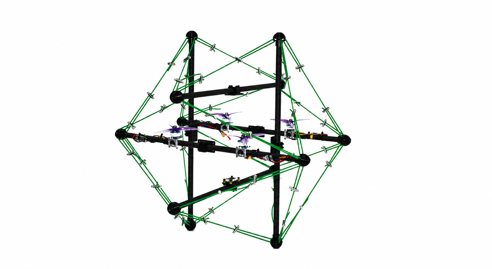

# EcatV2 Master（特种版）

**ROS 2 + SOEM EtherCAT Master for Drones**

  
  
  
  
  

面向 **STM32H750 + AX58100** EtherCAT 从站的 ROS 2 / SOEM Master。  
当前项目主线整合 **6 × HIPNUC IMU、DJI RC / DBUS、DShot、网页 TaskEditor 与运行诊断**。

> [!IMPORTANT]
> **当前推荐部署分支：[`feature/6imu-rc-dshot-pdo-v006`](https://github.com/ssybh2/EcatV2_Master/tree/feature/6imu-rc-dshot-pdo-v006)**  
> `main` 保留为仓库入口与原始兼容基线。部署 6-IMU / DJI RC / DShot 系统时，请使用上面的 ProductCode `0x06` 分支。

---

## Quick Start 快速入口

| | |
| --- | --- |
| 📘 **[完整部署教程](https://github.com/ssybh2/EcatV2_Master/blob/feature/6imu-rc-dshot-pdo-v006/docs/6imu-deployment-beginner-cn.md)** | 📦 **[H750 Slave v0.6.1](https://github.com/ssybh2/EcatV2_AX58100_H750_Universal/releases/tag/v0.6.1)** |
| 🚀 **[进入当前部署分支](https://github.com/ssybh2/EcatV2_Master/tree/feature/6imu-rc-dshot-pdo-v006)** | 🧩 **[打开在线 TaskEditor](https://ssybh2.github.io/EcatV2_Master/)** |
| 🧪 **[6-IMU 压力测试](https://github.com/ssybh2/EcatV2_Master/blob/feature/6imu-rc-dshot-pdo-v006/docs/6imu-500hz-test-plan.md)** | 🔧 **[HIPNUC G431 Firmware](https://github.com/ssybh2/hipnucimu/actions)** |

---

## 当前系统

  
   
  <b>Ethercat 特种版目标飞行平台</b>

 

这套 **Ethercat 特种版** 为**张拉体无人机平台**定制的 EtherCAT 主站配置。
同时接入 **6 路 HIPNUC IMU、DJI RC / DBUS 与 DShot**，当前配置采用 **8-task profile**，并对过程数据空间进行了扩展：Application PDO 为 **80 B Master→Slave / 192 B Slave→Master**，用于容纳多路 IMU、诊断、遥控输入与执行器控制数据。

---

## TaskEditor

### 🧩 [Open ProductCode 0x06 TaskEditor](https://ssybh2.github.io/EcatV2_Master/)

无需手写整份 YAML。配置 Slave Serial、IMU topic / frame、DJI RC 和 DShot 参数后，可以直接生成 `config.yaml`。

---

## 文档

| 文档 | 用途 |
| --- | --- |
| **[完整部署教程（小白版）](https://github.com/ssybh2/EcatV2_Master/blob/feature/6imu-rc-dshot-pdo-v006/docs/6imu-deployment-beginner-cn.md)** | 从 Ubuntu、固件烧录到 ROS 2 验收 |
| **[ProductCode 0x06 部署说明](https://github.com/ssybh2/EcatV2_Master/blob/feature/6imu-rc-dshot-pdo-v006/docs/6imu-dji-rc-dshot-deployment-cn.md)** | 当前 profile、EEPROM / SII 与实机基线 |
| **[TaskEditor 说明](https://github.com/ssybh2/EcatV2_Master/blob/feature/6imu-rc-dshot-pdo-v006/docs/6imu-task-editor.md)** | 8-task 配置生成器 |
| **[6-IMU 压力测试计划](https://github.com/ssybh2/EcatV2_Master/blob/feature/6imu-rc-dshot-pdo-v006/docs/6imu-500hz-test-plan.md)** | 多 IMU、诊断与稳定性验证 |

---

## 配套仓库

| 模块 | 当前推荐 |
| --- | --- |
| **Master** | [`EcatV2_Master · feature/6imu-rc-dshot-pdo-v006`](https://github.com/ssybh2/EcatV2_Master/tree/feature/6imu-rc-dshot-pdo-v006) |
| **H750 + AX58100 Slave** | [`feature/6imu-rc-dshot-pdo-v006`](https://github.com/ssybh2/EcatV2_AX58100_H750_Universal/tree/feature/6imu-rc-dshot-pdo-v006) · **[v0.6.1 Release](https://github.com/ssybh2/EcatV2_AX58100_H750_Universal/releases/tag/v0.6.1)** |
| **HIPNUC G431 bridge** | [`hipnucimu · feature/6imu-500hz-stable`](https://github.com/ssybh2/hipnucimu/tree/feature/6imu-500hz-stable) |

> Master、Slave、AX58100 EEPROM 与 YAML 配置必须使用同一套 ProductCode `0x06` profile，不要与旧 `0x05` 配置混用。

---

## 当前状态

- ✅ ProductCode `0x06` EtherCAT profile
- ✅ 6 × HIPNUC IMU 链路
- ✅ DJI RC / DBUS 软件集成
- ✅ DShot 软件集成
- ✅ 在线 8-task TaskEditor
- ✅ RAW PDO GAP / EtherCAT loop-stall diagnostics
- ✅ STM32H750 + AX58100 SAFE_OP / OP 实机验证

DJI RC 与 DShot 的最终执行器实机测试仍应根据具体硬件，在安全条件下分别完成。

---

<strong>原始 main / upstream-compatible baseline</strong>

 

`main` 继续保留原始 EcatV2 Master 的通用 ROS 2 + SOEM 能力，包括 YAML 配置、实时 CPU 绑定、EtherCAT 断线恢复以及常用从站工具。

原始教程入口：

- [Environment Setup](docs/environment-setup.md)
- [First Run Test](docs/first-run-test.md)
- [Configuration Generator](docs/configuration-generator.md)
- [FAQ](docs/faq.md)

原始单从站 RTT 测试记录为：平均约 `0.241 ms`，99th percentile 约 `0.333 ms`。这些数据属于原始 baseline 测试环境，不代表当前 6-IMU 系统的最终性能指标。

---

## Safety

> [!CAUTION]
> 首次进行 DShot 实机测试时，请先卸下桨叶或解除机械负载，并准备可靠的断电方式。

---

**EcatV2 Master · ProductCode 0x06 deployment line**

[Current Branch](https://github.com/ssybh2/EcatV2_Master/tree/feature/6imu-rc-dshot-pdo-v006) · [TaskEditor](https://ssybh2.github.io/EcatV2_Master/) · [Deployment Guide](https://github.com/ssybh2/EcatV2_Master/blob/feature/6imu-rc-dshot-pdo-v006/docs/6imu-deployment-beginner-cn.md)

