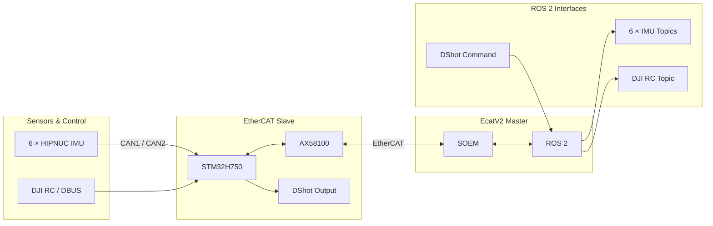

<div align="center">

# EcatV2 Master

**ROS 2 + SOEM EtherCAT Master for 6-IMU · DJI RC · DShot**

<p>
  
  
  
  
  
  
</p>

面向 **STM32H750 + AX58100** EtherCAT 从站的 ROS 2 Master。  
当前分支整合 **6 × HIPNUC IMU、DJI RC / DBUS、DShot、TaskEditor 与运行诊断**。

**Current branch:** `feature/6imu-rc-dshot-pdo-v006`

</div>

> [!IMPORTANT]
> 当前使用 **ProductCode `0x06`**。Master、Slave、EEPROM 与配置文件必须使用同一套 profile。

---

## 系统拓扑



<div align="center">
<sub>HIPNUC / DJI RC → STM32H750 → AX58100 → EtherCAT → SOEM → ROS 2</sub>
</div>

---

## 快速开始

### 1 · 切换到当前分支

```bash
git checkout feature/6imu-rc-dshot-pdo-v006
git submodule update --init --recursive
```

### 2 · 生成本机 bringup

```bash
./tools/prepare_6imu_rc_dshot_bringup.sh \
  <slave-serial> \
  <ethercat-interface> \
  <rt-cpu> \
  <non-rt-cpus>
```

### 3 · 编译并启动

```bash
source /opt/ros/humble/setup.bash
colcon build
source install/setup.bash

ros2 launch soem_bringup bringup.launch.py
```

---

## 在线 TaskEditor

<div align="center">

### 🧩 [Open ProductCode 0x06 TaskEditor](https://ssybh2.github.io/EcatV2_Master/)

无需手动整理 YAML，可直接生成当前 8-task `config.yaml`。

</div>

---

## 文档与资源

| 入口 | 用途 |
| --- | --- |
| 📘 **[完整部署教程（小白版）](docs/6imu-deployment-beginner-cn.md)** | 从环境、固件到 ROS 2 验收 |
| ⚙️ **[ProductCode 0x06 部署说明](docs/6imu-dji-rc-dshot-deployment-cn.md)** | PDO、EEPROM / SII 与部署基线 |
| 🧩 **[TaskEditor 说明](docs/6imu-task-editor.md)** | 8-task 配置生成器 |
| 🧪 **[6-IMU 压力测试计划](docs/6imu-500hz-test-plan.md)** | 多 IMU 与稳定性验证 |
| 📦 **[Master Releases](https://github.com/ssybh2/EcatV2_Master/releases)** | Deployment Bundle 与版本发布 |

---

## 配套组件

| Component | Recommended |
| --- | --- |
| **Master** | `feature/6imu-rc-dshot-pdo-v006` |
| **H750 + AX58100 Slave** | [Release v0.6.1](https://github.com/ssybh2/EcatV2_AX58100_H750_Universal/releases/tag/v0.6.1) |
| **HIPNUC G431 bridge** | `feature/6imu-500hz-stable` |

---

## 当前状态

> ✅ **6-IMU + EtherCAT** 已完成当前实机基线验证并可进入 OP。  
> 🟡 **DJI RC / DShot** 软件链路已集成，最终遥控器 / 执行器实机测试仍应按具体硬件与安全条件完成。

<details>
<summary><b>Legacy / Safety</b></summary>

<br>

旧 ProductCode `0x05` profile 仅保留用于历史兼容，**不要与当前 `0x06` 配置混用**。

首次进行 DShot 实机测试时，请先卸下桨叶或解除机械负载，并准备可靠的断电方式。

</details>

---

<div align="center">

### Related repositories

[H750 + AX58100 Slave](https://github.com/ssybh2/EcatV2_AX58100_H750_Universal) · [HIPNUC IMU Forward Bridge](https://github.com/ssybh2/hipnucimu)

</div>
